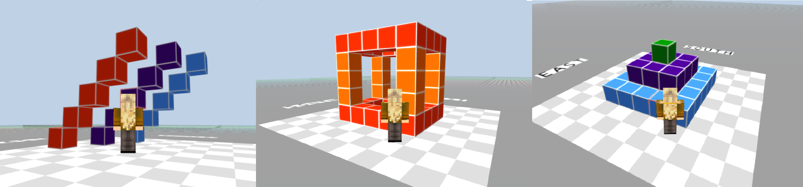
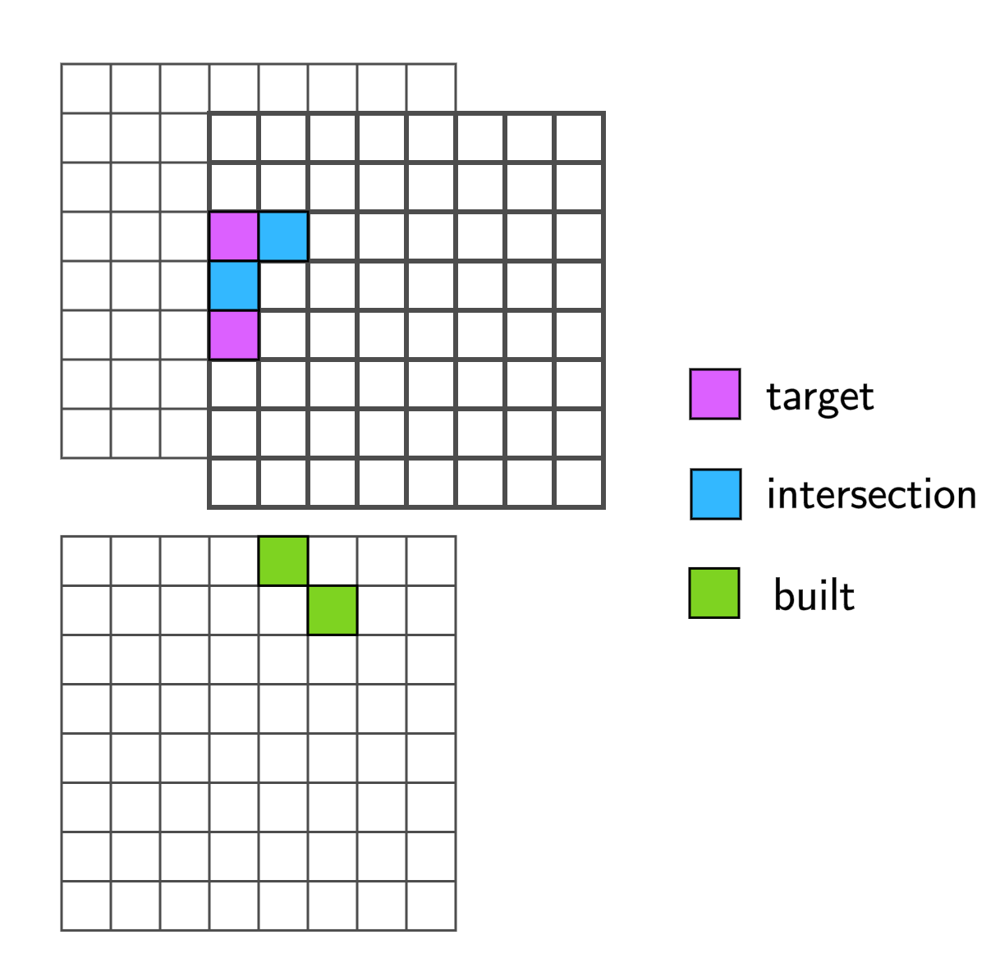

# IGLU Datasets

Interactive Grounded Language Understanding in a Collaborative Environment
--

The primary goal of the IGLU project is to approach the problem of how
to develop interactive agents that learn to solve a task while provided with grounded natural language
instructions in a collaborative environment.

Following this objective, the project has collected several datasets with different types of interactions during a block building task. The data and scripts used to collect it will be progressively released in this repository.

Due to the complexity of a general interactive task, the problem is simplified to interactions inside of a finite, Minecraft-like world of blocks. The goal of the interaction is to build a structure using a limited number of block types, which can vary in complexity. Examples of possible target structures to build are:



 Two roles arise: the Architect is provided with a target structure that needs to be built by the Builder. The Architect provides instructions to the Builder on how to create the target structure and the Builder can ask clarifying questions to the Architect if an instruction is unclear.

The progression of each game is recorded, corresponding to the construction of a target structure
by an Architect and Builder pair, as a discrete sequence of game observations. Each observation
contains the following information: 1) a time stamp, 2) the chat history up until that point in time,
3) the Builder’s position (a tuple of real-valued x, y, z coordinates as well as pitch and yaw angles,
representing the orientation of their camera), 4) the Builder’s block inventory, 5) the locations of
the blocks in the build region.


TODO add past competition links

TODO Add citation

## Working with IGLU datasets 


By default, the environment requires a task object to run.
IGLU dataset provides a convenient loader for RL tasks. Here is an example of how to use it:

```python
import gym
from gridworld.data import IGLUDataset

dataset = IGLUDataset(dataset_version='v0.1.0-rc1') 
# leave dataset_version empty to access the most recent version of the dataset.

env = gym.make('IGLUGridworld-v0')
env.set_task_generator(dataset)
```

In this example, we download the dataset of tasks for RL env. 
Internally, on each `.reset()` of the env, the dataset samples a random task (inside its own `.reset()` method) and makes it active in the env. The `Task` object is responsible for calculating the reward, providing the text part of the observation, and determining if the episode has ended.

The structure of the IGLU dataset is following. The dataset consists of structures that represent overall collaboration goals. For each structure, we have several collaboration sessions that pair architects with builders to build each particular structure. Each session consists of a sequence of "turns". Each turn represents an *atomic* instruction and corresponding changes of the blocks in the world. The structure of a `Task` object is following:

  * `target_grid` - target blocks configuration that needs to be built
  * `starting_grid` - optional, blocks for the environment to begin the episode with.
  * `chat` - full conversation between the architect and builder, including the most recent instruction
  * `last_instruction` - last utterance of the architect

Sometimes, the instructions can be ambiguous and the builder asks a clarifying question which the architect answers. In the latter case, `last_instruction` will contain three utterances: an instruction, a clarifying question, and an answer to that question. Otherwise, `last_instruction` is just one utterance of the architect.

To represent collaboration sessions, the `Subtasks` class is used. This class represents a sequence of dialog utterances and their corresponding goals (each of which is a partially completed structure). On `.reset()` call, it picks a random turn and returns a `Task` object, where starting and target grids are consecutive partial structures and the dialog contains all utterances up until the one corresponding to the target grid.

In the example above, the dataset object is structured as follows:

```python
# .tasks is a dict mapping from structure to a list of sessions of interaction
dataset.tasks 
# each value contains a list corresponding to collaboration sessions.
dataset.tasks['c73']
# Each element of this list is an instance of `Subtasks` class
dataset.tasks['c73'][0]
```

The `.reset()` method of `IGLUDataset` does effectively the following:

```python
def reset(dataset):
  task_id = random.choice(dataset.tasks.keys())
  session = random.choice(dataset.tasks[task_id])
  subtask = session.reset() # Task object is returned
  return subtask
```

This behavior can be customized simply by overriding the reset method in a subclass:

```python
import gym
from gridworld.data import IGLUDataset

class MyDataset(IGLUDataset):
  def __init__(self, *args, **kwargs):
    super().__init__(*args, **kwargs)
    self.my_task_id = 'c73'
    self.my_session = 0
  
  def reset(self):
    return self.tasks[self.my_task_id][self.my_session].reset()

env = gym.make('IGLUGridworld-v0')
my_dataset = MyDataset(dataset_version='v0.1.0-rc1')
env.set_task_generator(my_dataset)
# do training/sampling
```

On the first creation, the dataset is downloaded and parsed automatically. Below you will find the structure of the dataset:

```
dialogs.csv
builder-data/
  ...
  1-c118/ # session id - structure_id
    step-2
  ...
  9-c118/
    step-2
    step-4
    step-6
  1-c120/
    step-2
  ...
  23-c126/
    step-2
    step-4
    step-6
    step-8
```

Here, `dialog.csv` contains the utterances of architects and builders solving different tasks in 
different sessions. The `builder-data/` directory contains builder behavior recorded by the voxel.js engine. Right now we extract only the resulting grids and use them as targets.


### Grid prediction score calculation

TODO: rewrite without RL

Given a predicted grid and a target one, the intersection score is calculated based on their similarity. The score is determined regardless of global spatial position of currently placed blocks, it only takes into account how much the built blocks are similar to the target structure. To make it possible, at each step we calculate the intersection between the built and the target structures for each spatial translation within the horizontal plane and rotation around the vertical axis. Then we take the maximal intersection value among all translation and rotations. To calculate the score, we compare the maximal intersection size from the current step with the one from the previous step. We reward the agent with `2` for the increase of the maximal intersection size, with `-2` for the decrease of the maximal intersection size, and with `1`/`-1` for removing/placing a block without a change of the maximal intersection size. A visual example is shown below.



Specifically, we run the code that is equivalent to the following one. Note that our version is much more optimized, while the version is given for reference:

```python
def maximal_intersection(grid, target_grid):
  """
  Args:
    grid (np.ndarray[Y, X, Z]): numpy array snapshot of a built structure
    target_grid (np.ndarray[Y, X, Z]): numpy array snapshot of the target structure
  """
  maximum = 0
  # iterate over orthogonal rotations
  for i in range(4):
    # iterate over translations
    for dx in range(-X, X + 1):
      for dz in range(-Z, Z + 1):
        shifted_grid = translate(grid, dx, dz)
        intersection = np.sum( (shifted_grid == target) & (target != 0) )
        maximum = max(maximum, intersection)
    grid = rotate_y_axis(grid)
  return maximum
```

In practice, a more optimized version is used. The reward is then calculated based on the temporal difference between maximal intersection of the two consecutive grids. Formally, suppose `grids[t]` is a built structure at timestep `t`. The reward is then calculated as:

```python
def calc_reward(prev_grid, grid, target_grid, , right_scale=2, wrong_scale=1):
  prev_max_int = maximal_intersection(prev_grid, target_grid)
  max_int = maximal_intersection(grid, target_grid)
  diff = max_int - prev_max_int
  prev_grid_size = num_blocks(prev_grid)
  grid_size = num_blocks(grid)
  if diff == 0:
    return wrong_scale * np.sign(grid_size - prev_grid_size)
  else:
    return right_scale * np.sign(diff)
```

In other words, if a recently placed block strictly increases or decreases the maximal intersection, the reward is positive or negative and is equal to `+/-right_scale`. Otherwise, its absolute value is equal to `wrong_scale` and the sign is positive if a block was removed or negative if added.
Values `right_scale` and `wrong_scale` can be passed to `gym.make` as environment kwargs. Finally, the `maximal_intersection` includes heavy computations that slow down the environment. They can be simplified by disabling rotational/translational invariance at the cost of much more sparse reward. To do that, pass `invariant=False` to a corresponding `Task` object (see Dataset section for reference).


## Contributing

This project welcomes contributions and suggestions.  Most contributions require you to agree to a
Contributor License Agreement (CLA) declaring that you have the right to, and actually do, grant us
the rights to use your contribution. For details, visit https://cla.opensource.microsoft.com.

When you submit a pull request, a CLA bot will automatically determine whether you need to provide
a CLA and decorate the PR appropriately (e.g., status check, comment). Simply follow the instructions
provided by the bot. You will only need to do this once across all repos using our CLA.

This project has adopted the [Microsoft Open Source Code of Conduct](https://opensource.microsoft.com/codeofconduct/).
For more information see the [Code of Conduct FAQ](https://opensource.microsoft.com/codeofconduct/faq/) or
contact [opencode@microsoft.com](mailto:opencode@microsoft.com) with any additional questions or comments.

## Trademarks

This project may contain trademarks or logos for projects, products, or services. Authorized use of Microsoft 
trademarks or logos is subject to and must follow 
[Microsoft's Trademark & Brand Guidelines](https://www.microsoft.com/en-us/legal/intellectualproperty/trademarks/usage/general).
Use of Microsoft trademarks or logos in modified versions of this project must not cause confusion or imply Microsoft sponsorship.
Any use of third-party trademarks or logos are subject to those third-party's policies.
